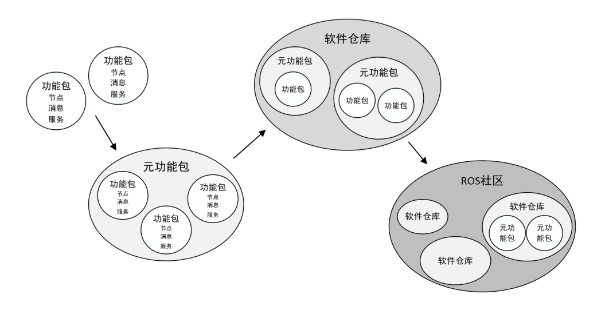
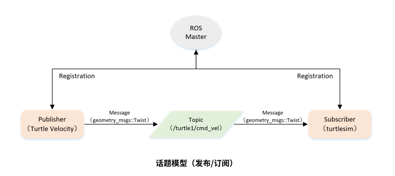
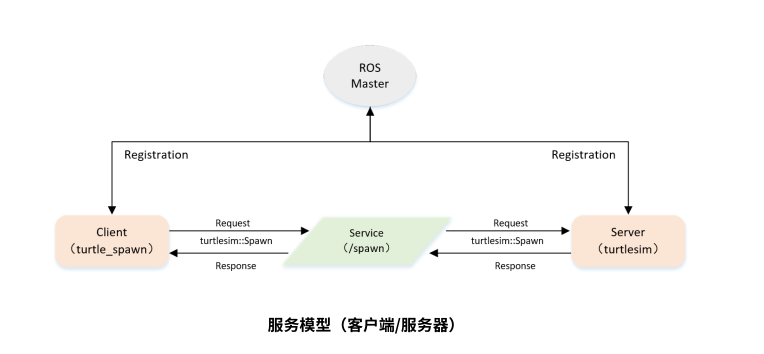
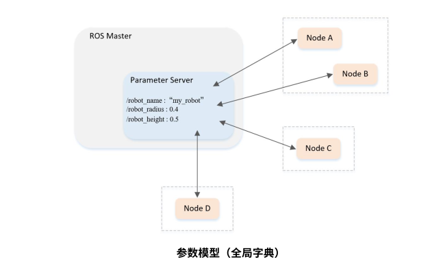
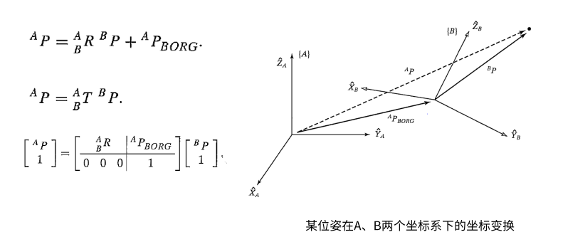
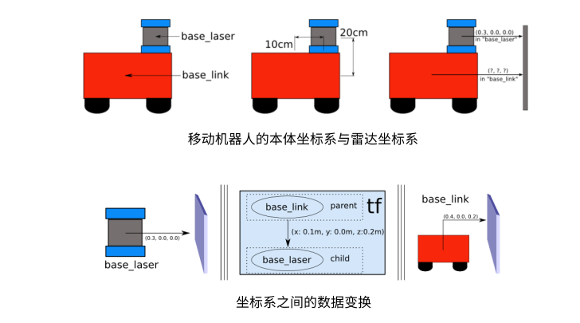

[toc]

## ROS学习笔记

### 一、ROS的简单介绍

- ROS(Robot Operating System)是一个用于机器人开发的开源框架，提供了一组软件库和工具，帮助开发者构建机器人应用。虽然名字里有“操作系统”，但实际上它更像是一个元操作系统，运行在现有的操作系统(如Linux)的基础上。

### 二、ROS的核心概念

#### 1、通信机制

​	ROS通过发布-订阅(Publish-Subscribe)、服务(Services)和动作(Actions)等机制实现节点间的通信。发布-订阅机制允许一个节点发布信息，多个节点订阅并接收信息；服务和动作则允许节点之间进行同步通信。

#### 2、节点与节点管理器

- 节点(Node) —— 执行单元
     - 执行具体任务的进程、独立运行的可执行文件；
     - 不同节点可使用不同的编程语言，可分布式运行在不同的主机；
     - <b>节点在系统中的名称必须是唯一的；</b>

- 节点管理器(ROS Master) —— 控制中心
    - 为节点提供命名和注册服务；
    - 跟踪和记录话题/服务通信，辅助节点相互查找、建立联系；
    - 提供参数服务器，节点使用此服务器存储和检索运行时的参数。

#### 3、话题通信

- 话题(Topic) —— 异步通信机制
    - 节点间用来传输数据的重要总线；
    - 使用发布/订阅模型，数据由发布者传输到订阅者，<b>同一个话题的订阅者或发布者可以不唯一；</b>
- 消息(Message) —— 话题数据
    - 具有一定的类型和数据结构，包括ROS提供的标准类型和用户自定义类型；
    - 使用编程语言无关的.msg文件定义，编译过程中生成对应的代码文件。

#### 4、服务通信

- 服务(Service) —— 同步通信机制
    - 使用客户端/服务器(C/S)模型，客户端发送请求数据，服务器完成处理后返回应答数据；
    - 使用编程语言无关的.srv文件定义请求和应答数据结构，编译的过程中生成对应的代码文件。

#### 5、话题VS服务

<table>
  <thead>
    <tr>
      <th></th>
      <th>话题</th>
      <th>服务</th>
    </tr>
  </thead>
  <tbody>
    <tr>
      <td>同步性</td>
      <td>异步</td>
      <td>同步</td>
    </tr>
    <tr>
      <td>通信模型</td>
      <td>发布/订阅</td>
      <td>服务器/客户端</td>
    </tr>
	<tr>
      <td>底层逻辑</td>
      <td>ROSTCP/ROSUDP</td>
      <td>ROSTCP/ROSUDP</td>
    </tr>
    <tr>
      <td>反馈机制</td>
      <td>无</td>
      <td>有</td>
    </tr>
    <tr>
      <td>缓冲区</td>
      <td>有</td>
      <td>无</td>
    </tr>
    <tr>
      <td>实时性</td>
      <td>弱</td>
      <td>强</td>
    </tr>
    <tr>
      <td>节点关系</td>
      <td>多对多</td>
      <td>一对多(一个Server)</td>
    </tr>
    <tr>
      <td>适用场景</td>
      <td>数据传输</td>
      <td>逻辑处理</td>
    </tr>
  </tbody>
</table>
#### 6、参数

- 参数(Parameter) —— 全局共享字典
    - 可以通过网络访问的共享、多变量字典；
    - 节点使用此服务器来存储和检索运行时的参数；
    - <b>适合存储静态、非二进制的配置参数，不适合存储动态配置的数据。</b>

#### 7、文件系统

- 功能包(Package)
    - ROS软件中的基本单元，包含节点源码、配置文件、数据定义等。
- 功能包清单(Package manifest)
    - 记录功能包的基本信息，包含作者信息、许可信息、依赖选项、编译标志等。
- 元功能包(Meta Package)
    - 组织多个用于同一目的功能包

### 三、创建工作空间与功能包

#### 1、工作空间：工作空间(workspacr)是存放工程开发相关文件的

- **`src`** ： 代码空间（Source Space）
- **`build`**：编译空间（Build Space）
- **`devel`**：开发空间（Development Space）
- **`install`**：安装空间（Install Space）

#### 2、创建工作空间

- 创建工作空间

~~~
mkdir -p ~/catkin_ws/src
cd ~/catkin_ws/src
catkin_init_workspace
~~~

- 编译工作空间

~~~
cd ~/catkin_ws/
catkin_make
~~~

- 设置环境变量

~~~
source devel/setup.bash
~~~

- 检查环境变量

~~~
echo &ROS_PACKAGE_PATH
~~~

#### 3、创建功能包

- 创建功能能包

~~~
cd ~/catkin_ws/src
catkin_create_pkg test_pkg std_msgs rospy roscpp
~~~

- 编译功能包

~~~
cd ~/catkin_ws
catkin_make
source ~/catkin_ws/devel/setup.bash
~~~

***同一个工作空间下，不允许存在同名功能包***

***不同工作空间下，允许存在同名功能包***

### 四、发布者Publish和订阅者Subscriber的编码实现

#### 1、创建功能包

~~~
cd ~/catkin_ws/src
catkin_create_pkg learning_topic roscpp rospy std_mesgs geometry_msgs turtlesim
~~~

#### 2、创建发布者代码

~~~
cd ~/catkin_ws/src/learning_topic/src
vim velocity_publisher.cpp
~~~

- 初始化ROS节点
- 向ROS Master注册节点信息，包括发布的话题名和话题中的消息类型
- 创建消息数据
- 按照一定频率循环发布消息

~~~
#include <ros/ros.h>
#include <geometry_msgs/Twist.h>

int main(int argc, char **argv)
{
	// ROS节点初始化
	ros::init(argc, argv, "velocity_publisher");

	// 创建节点句柄
	ros::NodeHandle n;

	// 创建一个Publisher，发布名为/turtle1/cmd_vel的topic，消息类型为geometry_msgs::Twist，队列长度10
	ros::Publisher turtle_vel_pub = n.advertise<geometry_msgs::Twist>("/turtle1/cmd_vel", 10);

	// 设置循环的频率
	ros::Rate loop_rate(10);

	int count = 0;
	while (ros::ok())
	{
	    // 初始化geometry_msgs::Twist类型的消息
		geometry_msgs::Twist vel_msg;
		vel_msg.linear.x = 0.5;
		vel_msg.angular.z = 0.2;

	    // 发布消息
		turtle_vel_pub.publish(vel_msg);
		ROS_INFO("Publsh turtle velocity command[%0.2f m/s, %0.2f rad/s]", 
				vel_msg.linear.x, vel_msg.angular.z);

	    // 按照循环频率延时
	    loop_rate.sleep();
	}

	return 0;
}
~~~

#### 3、在CMakeList.txt配置编译规则

- 设置需要编译的代码和生成的可执行文件
- 设置链接库

~~~

## Add cmake target dependencies of the executable
## same as for the library above
# add_dependencies(${PROJECT_NAME}_node ${${PROJECT_NAME}_EXPORTED_TARGETS} ${catkin_EXPORTED_TARGETS})

## Specify libraries to link a library or executable target against
# target_link_libraries(${PROJECT_NAME}_node
#   ${catkin_LIBRARIES}
# )

add_executable(velocity_publisher src/velocity_publisher.cpp)
target_link_libraries(velocity_publisher ${catkin_LIBRARIES})
~~~

#### 4、编译并运行发布者

~~~
cd ~/catkin_ws
catkin_make
source devel/setup.bash
roscore
rosrun turtlesim turtlesim_node
rosrun learning_topic velocity_publisher
~~~

#### 5、创建订阅者代码

~~~
cd ~/catkin_ws/src/learning_topic/src
vim pose_subscriber.cpp 
~~~

- 初始化ROS节点
- 订阅需要的话题
- 循环等待话题消息，接收到消息后进入回调函数
- 在回调函数中完成消息处理

~~~
#include <ros/ros.h>
#include "turtlesim/Pose.h"

// 接收到订阅的消息后，会进入消息回调函数
void poseCallback(const turtlesim::Pose::ConstPtr& msg)
{
    // 将接收到的消息打印出来
    ROS_INFO("Turtle pose: x:%0.6f, y:%0.6f", msg->x, msg->y);
}

int main(int argc, char **argv)
{
    // 初始化ROS节点
    ros::init(argc, argv, "pose_subscriber");

    // 创建节点句柄
    ros::NodeHandle n;

    // 创建一个Subscriber，订阅名为/turtle1/pose的topic，注册回调函数poseCallback
    ros::Subscriber pose_sub = n.subscribe("/turtle1/pose", 10, poseCallback);

    // 循环等待回调函数
    ros::spin();

    return 0;
}
~~~

### 五、话题消息的定义和使用

- 原始数据类型，每一个都可以变成数组形式
    - bool
    - byte
    - char
    - float32，float64
    - int8，uint8
    - int32，uint32
    - int64，uint64
    - string

#### 1、自定义话题类型

- 定义msg文件

~~~
cd ~/catkin_ws/src/learning_topic
mkdir msg
cd msg
vim Person.msg
~~~

<b>Person.msg</b>

~~~
string name
uint8 sex
uint8 age

uint unknown = 0
uint8 male = 1
uint8 female = 2
~~~

#### 2、创建发布者代码

~~~
cd ~/catkin_ws/src/learning_topic/src
vim person_publisher.cpp
~~~

- 初始化ROS节点
- 向ROS Master注册节点信息，包括发布的话题和话题中的消息类型
- 创建消息数据
- 按照一定的频率循环发布消息

~~~
#include <ros/ros.h>
#include "learning_topic/Person.h"

int main(int argc, char **argv)
{
    // ROS节点初始化
    ros::init(argc, argv, "person_publisher");

    // 创建节点句柄
    ros::NodeHandle n;

    // 创建一个Publisher，发布名为/person_info的topic，消息类型为learning_topic::Person，队列长度10
    ros::Publisher person_info_pub = n.advertise<learning_topic::Person>("/person_info", 10);

    // 设置循环的频率
    ros::Rate loop_rate(1);

    int count = 0;
    while (ros::ok())
    {
        // 初始化learning_topic::Person类型的消息
    	learning_topic::Person person_msg;
		person_msg.name = "Tom";
		person_msg.age  = 18;
		person_msg.sex  = learning_topic::Person::male;

        // 发布消息
		person_info_pub.publish(person_msg);

       	ROS_INFO("Publish Person Info: name:%s  age:%d  sex:%d", 
				  person_msg.name.c_str(), person_msg.age, person_msg.sex);

        // 按照循环频率延时
        loop_rate.sleep();
    }

    return 0;
}
~~~

#### 3、创建订阅者

~~~
cd ~/catkin_ws/src/learning_topic/src
vim person_subscriber.cpp
~~~

- 初始化ROS节点
- 订阅需要的话题
- 循环等待话题消息，接收到消息后进入回调函数
- 在回调函数中完成消息处理

~~~
#include <ros/ros.h>
#include "learning_topic/Person.h"

// 接收到订阅的消息后，会进入消息回调函数
void personInfoCallback(const learning_topic::Person::ConstPtr& msg)
{
    // 将接收到的消息打印出来
    ROS_INFO("Subcribe Person Info: name:%s  age:%d  sex:%d", 
			 msg->name.c_str(), msg->age, msg->sex);
}

int main(int argc, char **argv)
{
    // 初始化ROS节点
    ros::init(argc, argv, "person_subscriber");

    // 创建节点句柄
    ros::NodeHandle n;

    // 创建一个Subscriber，订阅名为/person_info的topic，注册回调函数personInfoCallback
    ros::Subscriber person_info_sub = n.subscribe("/person_info", 10, personInfoCallback);

    // 循环等待回调函数
    ros::spin();

    return 0;
}
~~~

#### 3、在package.xml中添加功能包依赖

~~~
  <!--   <exec_depend>message_runtime</exec_depend> -->
  <!-- Use test_depend for packages you need only for testing: -->
  <!--   <test_depend>gtest</test_depend> -->
  <!-- Use doc_depend for packages you need only for building documentation: -->
  <!--   <doc_depend>doxygen</doc_depend> -->
  <buildtool_depend>catkin</buildtool_depend>
  <build_depend>geometry_msgs</build_depend>
  <build_depend>roscpp</build_depend>
  <build_depend>rospy</build_depend>
  <build_depend>std_msg</build_depend>
  <build_depend>turlesim</build_depend>
  <build_export_depend>geometry_msgs</build_export_depend>
  <build_export_depend>roscpp</build_export_depend>
  <build_export_depend>rospy</build_export_depend>
  <build_export_depend>std_msg</build_export_depend>
  <build_export_depend>turlesim</build_export_depend>
  <exec_depend>geometry_msgs</exec_depend>
  <exec_depend>roscpp</exec_depend>
  <exec_depend>rospy</exec_depend>
  <exec_depend>std_msg</exec_depend>
  <exec_depend>turlesim</exec_depend>
// 添加功能包依赖
  <build_depend>message_generation</build_depend>
  <exec_depend>message_runtime</exec_depend>

~~~

#### 4、在CMakeLists.txt添加编译选项

- 	~~~
    ## Find catkin macros and libraries
    ## if COMPONENTS list like find_package(catkin REQUIRED COMPONENTS xyz)
    ## is used, also find other catkin packages
    find_package(catkin REQUIRED COMPONENTS
      geometry_msgs
      roscpp
      rospy
      std_msgs
      turtlesim
      message_generation // 添加编译依赖
    )
    ~~~

- ~~~
    add_executable(person_publisher src/person_publisher.cpp)
    target_link_libraries(person_publisher ${catkin_LIBRARIES})
    add_dependencies(person_publisher ${PROJECT_NAME}_generate_messages_cpp) // 添加链接
    
    add_executable(person_subscriber src/person_subscriber.cpp)
    target_link_libraries(person_subscriber ${catkin_LIBRARIES})
    add_dependencies(person_subscriber ${PROJECT_NAME}_generate_messages_cpp)// 添加链接
    
    ~~~

- ~~~
    ###################################
    ## catkin specific configuration ##
    ###################################
    ## The catkin_package macro generates cmake config files for your package
    ## Declare things to be passed to dependent projects
    ## INCLUDE_DIRS: uncomment this if your package contains header files
    ## LIBRARIES: libraries you create in this project that dependent projects also need
    ## CATKIN_DEPENDS: catkin_packages dependent projects also need
    ## DEPENDS: system dependencies of this project that dependent projects also need
    catkin_package(
    #  INCLUDE_DIRS include
    #  LIBRARIES learning_topic
       CATKIN_DEPENDS geometry_msgs roscpp rospy std_msg turlesim message_runtime // 编译依赖
    #  DEPENDS system_lib
    )
    ~~~

#### 5、编译运行

~~~
cd ~/catkin_ws
catkin_make
source devel/setup.bash
roscore
rosrun learning_topic person_subscriber
rosrun learning_topic person_publisher
~~~

### 六、客户端Client和服务器Server的编程实现

#### 1、创建功能包

~~~
cd ~/catkin_ws/src
catkin_create_pkg learning_service roscpp rospy std_msgs geometry_msgs turtlesim
~~~

#### 2、创建客户端代码

~~~
cd ~/catkin_ws/src/learning_service/src
vim turtle_command_server.cpp
~~~

- 初始化ROS节点
- 创建一个Client实例
- 发布服务请求数据
- 等待Server处理之后的应答结果

~~~
#include <ros/ros.h>
#include <turtlesim/Spawn.h>

int main(int argc, char** argv)
{
    // 初始化ROS节点
	ros::init(argc, argv, "turtle_spawn");

    // 创建节点句柄
	ros::NodeHandle node;

    // 发现/spawn服务后，创建一个服务客户端，连接名为/spawn的service
	ros::service::waitForService("/spawn");
	ros::ServiceClient add_turtle = node.serviceClient<turtlesim::Spawn>("/spawn");

    // 初始化turtlesim::Spawn的请求数据
	turtlesim::Spawn srv;
	srv.request.x = 2.0;
	srv.request.y = 2.0;
	srv.request.name = "turtle2";

    // 请求服务调用
	ROS_INFO("Call service to spwan turtle[x:%0.6f, y:%0.6f, name:%s]", 
			 srv.request.x, srv.request.y, srv.request.name.c_str());

	add_turtle.call(srv);

	// 显示服务调用结果
	ROS_INFO("Spwan turtle successfully [name:%s]", srv.response.name.c_str());

	return 0;
};
~~~

#### 3、创建服务器代码

~~~
cd ~/catkin_ws/src/learning_service/src
vim turtle_spawn.cpp
~~~

- 初始化ROS节点
- 创建Server实例
- 循环等待服务情趣，进入回调函数
- 在回调函数中完成服务功能的处理，并反馈应答数据

~~~
#include <ros/ros.h>
#include <geometry_msgs/Twist.h>
#include <std_srvs/Trigger.h>

ros::Publisher turtle_vel_pub;
bool pubCommand = false;

// service回调函数，输入参数req，输出参数res
bool commandCallback(std_srvs::Trigger::Request  &req,
         			std_srvs::Trigger::Response &res)
{
	pubCommand = !pubCommand;

    // 显示请求数据
    ROS_INFO("Publish turtle velocity command [%s]", pubCommand==true?"Yes":"No");

	// 设置反馈数据
	res.success = true;
	res.message = "Change turtle command state!";

    return true;
}

int main(int argc, char **argv)
{
    // ROS节点初始化
    ros::init(argc, argv, "turtle_command_server");

    // 创建节点句柄
    ros::NodeHandle n;

    // 创建一个名为/turtle_command的server，注册回调函数commandCallback
    ros::ServiceServer command_service = n.advertiseService("/turtle_command", commandCallback);

	// 创建一个Publisher，发布名为/turtle1/cmd_vel的topic，消息类型为geometry_msgs::Twist，队列长度10
	turtle_vel_pub = n.advertise<geometry_msgs::Twist>("/turtle1/cmd_vel", 10);

    // 循环等待回调函数
    ROS_INFO("Ready to receive turtle command.");

	// 设置循环的频率
	ros::Rate loop_rate(10);

	while(ros::ok())
	{
		// 查看一次回调函数队列
    	ros::spinOnce();
		
		// 如果标志为true，则发布速度指令
		if(pubCommand)
		{
			geometry_msgs::Twist vel_msg;
			vel_msg.linear.x = 0.5;
			vel_msg.angular.z = 0.2;
			turtle_vel_pub.publish(vel_msg);
		}

		//按照循环频率延时
	    loop_rate.sleep();
	}

    return 0;
}
~~~

#### 4、配置编译规则

- CMakeList.txt

~~~
add_executable(turtle_spawn src/turtle_spawn)
target_link_libraries(turtle_spawn ${catkin_LIBRARIES})

add_executable(turtle_command_server src/turtle_command_server)
target_link_libraries(turtle_command_server ${catkin_LIBRARIES})

~~~

#### 5、编译运行

~~~
cd ~/catkin_ws
catkin_make
source devel/setup.bash
roscore
rosrun rosrun turtlesim turtlesim_node
rosrun learning_service turtle_command_server
rosservice call /turtle_command "{}"
~~~

###  七、服务器数据的定义与使用

#### 1、自定义服务数据

~~~
cd ~/catkin_ws/src/learning_service
mkdir src
cd src
vim Person.srv
~~~

- Person.srv

~~~
string name
uint8 age
uint8 sex

uint8 unknown = 0
uint8 male    = 1
uint8 famale  = 2
---
string result
~~~

虚线以上是请求数据，虚线以下是反馈数据

#### 2、创建服务器代码

~~~
cd ~/catkin_ws/src/learning_service/src
vim person_server.cpp
~~~

- 初始化ROS节点
- 创建Server实例
- 循环等待服务器请求，进入回调函数
- 在回调函数中完成服务功能的处理，并反馈应答数据

~~~
#include <ros/ros.h>
#include "learning_service/Person.h"

// service回调函数，输入参数req，输出参数res
bool personCallback(learning_service::Person::Request  &req,
         			learning_service::Person::Response &res)
{
    // 显示请求数据
    ROS_INFO("Person: name:%s  age:%d  sex:%d", req.name.c_str(), req.age, req.sex);

	// 设置反馈数据
	res.result = "OK";

    return true;
}

int main(int argc, char **argv)
{
    // ROS节点初始化
    ros::init(argc, argv, "person_server");

    // 创建节点句柄
    ros::NodeHandle n;

    // 创建一个名为/show_person的server，注册回调函数personCallback
    ros::ServiceServer person_service = n.advertiseService("/show_person", personCallback);

    // 循环等待回调函数
    ROS_INFO("Ready to show person informtion.");
    ros::spin();

    return 0;
}
~~~

 #### 3、创建客户端代码

~~~
cd ~/catkin_ws/src/learning_service/src
vim person_client.cpp
~~~

- 初始化ROS节点
- 创建一个Client实例
- 发布服务请求数据
- 等待Server处理之后的应答结果

~~~
#include <ros/ros.h>
#include "learning_service/Person.h"

int main(int argc, char** argv)
{
    // 初始化ROS节点
	ros::init(argc, argv, "person_client");

    // 创建节点句柄
	ros::NodeHandle node;

    // 发现/spawn服务后，创建一个服务客户端，连接名为/spawn的service
	ros::service::waitForService("/show_person");
	ros::ServiceClient person_client = node.serviceClient<learning_service::Person>("/show_person");

    // 初始化learning_service::Person的请求数据
	learning_service::Person srv;
	srv.request.name = "Tom";
	srv.request.age  = 20;
	srv.request.sex  = learning_service::Person::Request::male;

    // 请求服务调用
	ROS_INFO("Call service to show person[name:%s, age:%d, sex:%d]", 
			 srv.request.name.c_str(), srv.request.age, srv.request.sex);

	person_client.call(srv);

	// 显示服务调用结果
	ROS_INFO("Show person result : %s", srv.response.result.c_str());

	return 0;
};
~~~

#### 4、配置编译规则

- 设置需要编译的代码和生成的可执行文件
- 设置连接库
- 添加依赖项

~~~
add_executable(person_client src/person_client)
target_link_libraries(person_client ${catkin_LIBRARIES})
add_dependencies(person_client ${PROJECT_NAME}_gencpp)

add_executable(person_server src/person_server)
target_link_libraries(person_server ${catkin_LIBRARIES})
add_dependencies(person_server ${PROJECT_NAME}_gencpp)
~~~

~~~
catkin_package(
#  INCLUDE_DIRS include
#  LIBRARIES learning_service
   CATKIN_DEPENDS geometry_msgs roscpp rospy std_msgs turtlesim message_runtime
#  DEPENDS system_lib
)
~~~

~~~
find_package(catkin REQUIRED COMPONENTS
  geometry_msgs
  roscpp
  rospy
  std_msgs
  turtlesim
  message_generation
)
~~~

#### 5、编译运行

~~~
cd ~/catkin_ws
catkin_make
source devel/setup.bash
roscore
rosrun learning_service person_server
rosrun learning_service person_client
~~~

### 八、参数的使用与编程方法

#### 1、创建功能包

~~~
cd ~/catkin_ws/src
catkin_create_pkg learning_parameter roscpp rospy std_srvs
~~~

#### 2、参数命令行使用

- 列出当前所有参数

~~~
rosparam list
~~~

- 显示某个参数值

~~~
rosparam get param_key
~~~

- 设置某个参数值

~~~
rosparam set param_key param_value
~~~

- 保存某个参数到文件，文件类型为YAML文件

~~~
rosparam dump file_name
~~~

- 从文件读取参数

~~~
rosparam load file_name
~~~

- 删除参数

~~~
rosparam delete param_key
~~~

#### 3、编程方法

~~~
cd ~/catkin_ws/src/learning_parameter/src
vim parameter_config.cpp
~~~

- 初始化ROS节点
- get函数获取参数
- set函数设置参数

~~~
#include <string>
#include <ros/ros.h>
#include <std_srvs/Empty.h>

int main(int argc, char **argv)
{
	int red, green, blue;

    // ROS节点初始化
    ros::init(argc, argv, "parameter_config");

    // 创建节点句柄
    ros::NodeHandle node;

    // 读取背景颜色参数
	ros::param::get("/background_r", red);
	ros::param::get("/background_g", green);
	ros::param::get("/background_b", blue);

	ROS_INFO("Get Backgroud Color[%d, %d, %d]", red, green, blue);

	// 设置背景颜色参数
	ros::param::set("/turtlesim/background_r", 255);
	ros::param::set("/turtlesim/background_g", 255);
	ros::param::set("/turtlesim/background_b", 255);

	ROS_INFO("Set Backgroud Color[255, 255, 255]");

    // 读取背景颜色参数
	ros::param::get("/turtlesim/background_r", red);
	ros::param::get("/turtlesim/background_g", green);
	ros::param::get("/turtlesim/background_b", blue);

	ROS_INFO("Re-get Backgroud Color[%d, %d, %d]", red, green, blue);

	// 调用服务，刷新背景颜色
	ros::service::waitForService("/clear");
	ros::ServiceClient clear_background = node.serviceClient<std_srvs::Empty>("/clear");
	std_srvs::Empty srv;
	clear_background.call(srv);
	
	sleep(1);

    return 0;
}
~~~

#### 4、配置编译规则

- 设置需要的编译的代码和生成的可执行文件
- 设置链接库

- CMakeList.txt

~~~
add_executable(parameter_config src/parameter_config.cpp)
target_link_libraries(parameter_config ${catkin_LIBRARIES})
~~~

#### 5、编译并运行

~~~
cd ~/catkin_ws
catkin_make
source devel/setup.bash
roscore
rosrun turtlesim turtlesim_node
rosrun learning_parameter parameter_config
~~~

### 九、ROS中的坐标系管理系统

#### 1、机器人中的坐标变换

- 参考：《机器人学导论》

- TF功能能干什么？
    - 5秒钟之前，机器人头部坐标系相对于全局坐标系的关系是什么样的？
    - 机器人夹取的物体相对于机器人中心坐标系的位置在哪里？
    - 机器人中心坐标系相对于全局坐标系的位置在哪里？
- TF坐标变换如何实现？
    - 广播TF变换
    - 监听TF变换

#### 2、小海龟跟随实验

~~~
sudo apt-get install ros-melodic-turtle-tf
roslaunch turtle_tf turtle_tf_demo.launch
roslaunch turelesim turtle_teleop_key
rosrun view_frames
~~~

- 命令行工具

~~~
tf tf_echo turtle1 turtle2
~~~

- 可视化工具

~~~
rosrun rviz rviz -d 'rospack find turtlt_tf' /rviz/turtle_rviz.rviz
~~~

### 十、tf坐标系广播与监听的编程实现

#### 1、创建功能包

~~~
cd ~/catkin_ws/src
catkin_create_pkg learning_tf roscpp rospy tf turtlesim
~~~

#### 2、创建tf广播器代码

~~~
cd ~/catkin_ws/src/learning_tf/src
vim turtle_tf_broadcaster.cpp
~~~

- 定义TF广播器（TransformBroadcaster）
- 创建坐标变换值
- 发布坐标变换（sendTransform）

~~~
#include <ros/ros.h>
#include <tf/transform_broadcaster.h>
#include <turtlesim/Pose.h>

std::string turtle_name;

void poseCallback(const turtlesim::PoseConstPtr& msg)
{
	// 创建tf的广播器
	static tf::TransformBroadcaster br;

	// 初始化tf数据
	tf::Transform transform;
	transform.setOrigin( tf::Vector3(msg->x, msg->y, 0.0) );
	tf::Quaternion q;
	q.setRPY(0, 0, msg->theta);
	transform.setRotation(q);

	// 广播world与海龟坐标系之间的tf数据
	br.sendTransform(tf::StampedTransform(transform, ros::Time::now(), "world", turtle_name));
}

int main(int argc, char** argv)
{
    // 初始化ROS节点
	ros::init(argc, argv, "my_tf_broadcaster");

	// 输入参数作为海龟的名字
	if (argc != 2)
	{
		ROS_ERROR("need turtle name as argument"); 
		return -1;
	}

	turtle_name = argv[1];

	// 订阅海龟的位姿话题
	ros::NodeHandle node;
	ros::Subscriber sub = node.subscribe(turtle_name+"/pose", 10, &poseCallback);

    // 循环等待回调函数
	ros::spin();

	return 0;
};

~~~

#### 3、创建tf监听器代码

~~~
cd ~/catkin_ws/src/learning_tf/src
vim turtle_tf_listener.cpp
~~~

- 定义TF监听器（TransformListener）
- 查找坐标变换（waitTransform、lookupTransform）

~~~
#include <ros/ros.h>
#include <tf/transform_listener.h>
#include <geometry_msgs/Twist.h>
#include <turtlesim/Spawn.h>

int main(int argc, char** argv)
{
	// 初始化ROS节点
	ros::init(argc, argv, "my_tf_listener");

    // 创建节点句柄
	ros::NodeHandle node;

	// 请求产生turtle2
	ros::service::waitForService("/spawn");
	ros::ServiceClient add_turtle = node.serviceClient<turtlesim::Spawn>("/spawn");
	turtlesim::Spawn srv;
	add_turtle.call(srv);

	// 创建发布turtle2速度控制指令的发布者
	ros::Publisher turtle_vel = node.advertise<geometry_msgs::Twist>("/turtle2/cmd_vel", 10);

	// 创建tf的监听器
	tf::TransformListener listener;

	ros::Rate rate(10.0);
	while (node.ok())
	{
		// 获取turtle1与turtle2坐标系之间的tf数据
		tf::StampedTransform transform;
		try
		{
			listener.waitForTransform("/turtle2", "/turtle1", ros::Time(0), ros::Duration(3.0));
			listener.lookupTransform("/turtle2", "/turtle1", ros::Time(0), transform);
		}
		catch (tf::TransformException &ex) 
		{
			ROS_ERROR("%s",ex.what());
			ros::Duration(1.0).sleep();
			continue;
		}

		// 根据turtle1与turtle2坐标系之间的位置关系，发布turtle2的速度控制指令
		geometry_msgs::Twist vel_msg;
		vel_msg.angular.z = 4.0 * atan2(transform.getOrigin().y(),
				                        transform.getOrigin().x());			// 角速度
		vel_msg.linear.x = 0.5 * sqrt(pow(transform.getOrigin().x(), 2) +
				                      pow(transform.getOrigin().y(), 2));	// 线速度
		turtle_vel.publish(vel_msg);

		rate.sleep();
	}
	return 0;
};

~~~

#### 4、配置tf广播器与tf监听器编译规则

- 设置需要编译的代码和生成的可执行文件
- 设置连接库

~~~
add_executable(turtle_tf_broadcaster src/turtle_tf_broadcaster.cpp)
target_link_libraries(turtle_tf_broadcaster ${catkin_LIBRARIES})

add_executable(turtle_tf_listener src/turtle_tf_listener.cpp)
target_link_libraries(turtle_tf_listener ${catkin_LIBRARIES})
~~~

### 5、编译并运行

~~~
cd ~/catkin_ws
catkin_make
source devel/setup.bash
roscore
rosrun turtlesim turtlesim_node
rosrun learning_tf turtle_tf_broadcaster __name:=turtle1_tf_broadcaster /turtle1
rosrun learning_tf turtle_tf_broadcaster __name:=turtle2_tf_broadcaster /turtle2
rosrun learning_tf turtle_tf_listener
rosrun trutlesim turtle_teleop_key
~~~

### 十一、launch启动文件的使用方法

#### 1、Launch文件

Launch文件：通过XML文件实现多节点的配置和启动（<b>可自动启动ROS Master</b>）

~~~
cd ~/catkin_ws/src
catkin_create_pkg learning_launch
cd ~/catkin_ws/src/learning_launch/src
vim simple.launch
~~~

#### 2、Launch文件语法

~~~
<launch>
	<node pkg="turtlesim" name="sim1" type="turtlesim_node"/>
	<node pkg="turtlesim" name="sim2" type="turtlesim_node"/>
</launch>
~~~

<b>` <launch>` </b>

launch文件中的根元素采用`<launch>`标签定义

<b>`<node>`</b>

启动节点

~~~
<node pkg="package-name" type="executable-name" name="node-name" />
~~~

- pkg：节点所在的功能包名称
- type：节点的可执行文件名称
- name：节点运行时的名称
- output、respawn、required、ns、args

##### 参数设置

<b>`<param>/<rosparam>`</b>

设置ROS系统运行中的参数，存储在参数服务器中

~~~
<param name="output_frame" value="odom"/>
~~~

- name：参数名
- value：参数值

加载参数文件中的多个参数

~~~
<rosparam file="param.yaml" command="load" ns= "params"/>
~~~

<b>`<arg>` </b>

加载参数文件内部的局部变量，仅限于launch文件使用

~~~
<arg nmae="arg-name" default="arg-value"/>
~~~

- name：参数名
- value：参数值

调用：

~~~
<param name="foo" value=$(arg-name)"/>
<node name="node pkg=package"type "args=:$(arg arg-name)"/>
~~~

##### 重映射

<b>`<remap>`</b>

重映射ROS计算图资源的命名

~~~
<remap from="/turtlebot/cmd_vel" to="/cmd_vel"/>
~~~

- from：原名名
- to：映射之后的命名

##### 嵌套

<b>`<include>`</b>

包含其他launch文件，类似于C语言中的头文件包含

~~~
<include file="$(dirname)/other.launch" />
~~~

- file：包含的其他launch文件路径

#### 3、Launch示例

- simpale.launch

~~~
<launch>
    <node pkg="learning_topic" type="person_subscriber" name="talker" output="screen" />
    <node pkg="learning_topic" type="person_publisher" name="listener" output="screen" /> 
</launch>
~~~

- start_tf_demo_c++.launch

~~~
 <launch>

    <!-- Turtlesim Node-->
    <node pkg="turtlesim" type="turtlesim_node" name="sim"/>
    <node pkg="turtlesim" type="turtle_teleop_key" name="teleop" output="screen"/>

    <node pkg="learning_tf" type="turtle_tf_broadcaster" args="/turtle1" name="turtle1_tf_broadcaster" />
    <node pkg="learning_tf" type="turtle_tf_broadcaster" args="/turtle2" name="turtle2_tf_broadcaster" />

    <node pkg="learning_tf" type="turtle_tf_listener" name="listener" />

  </launch>
~~~

- turtlesim_parameter_config.launch

~~~- 
<launch>

	<param name="/turtle_number"   value="2"/>

    <node pkg="turtlesim" type="turtlesim_node" name="turtlesim_node">
		<param name="turtle_name1"   value="Tom"/>
		<param name="turtle_name2"   value="Jerry"/>

		<rosparam file="$(find learning_launch)/config/param.yaml" command="load"/>
	</node>

    <node pkg="turtlesim" type="turtle_teleop_key" name="turtle_teleop_key" output="screen"/>

</launch>
~~~

- turtlesim_remap.launch

~~~
<launch>

	<include file="$(find learning_launch)/launch/simple.launch" />

    <node pkg="turtlesim" type="turtlesim_node" name="turtlesim_node">
		<remap from="/turtle1/cmd_vel" to="/cmd_vel"/>
	</node>

</launch>
~~~

### 十二、常用可视化工具的使用

#### 1、Qt工具箱

- rqt_console：日志输出工具
- rqt_graph：计算图可视化工具
- rqt_plot：数据绘图工具
- rqt_image_view：图像渲染工具

##### --- rqt使用方法（留坑）-

#### 2、Rviz

<b>Rviz</b>是一款三维可视化工具，可以很好兼容基于ROS软件框架的机器人平台

- 在rviz中，可以使用可扩展标记语言XML对机器人、周围物体等任何实物进行尺寸、质量、位置、材质、关节等属性的描述，并且在界面中呈现出来。
- 同时，rviz还可以通过图形化的方式，实现显示机器人传感器的信息、机器人的运动状态、周围环境的变化等信息。
- 总之，rviz等通过机器人模型参数、机器人发布的传感器信息等数据，为用户进行所以可监测信息的图形化显示。用户和开发者也可以在rviz的控制界面下，通过按钮、滑动条、数值等方式，控制机器人的行为。

##### --Rviz使用方法（留坑）--

#### 3、Gazebo

<b>Gazebo</b>是一款功能强大的三维仿真平台

- 具备强大的物理引擎
- 高质量的图形渲染
- 方便的编程与图像接口
- 开源免费

其典型应用场景包括

- 测试机器人算法
- 机器人的设计
- 现实情景下的回溯测试

##### ---Gazebo使用方法（留坑）---

