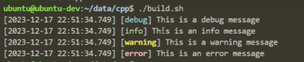
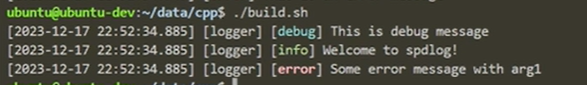
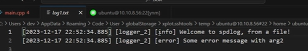
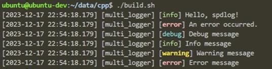
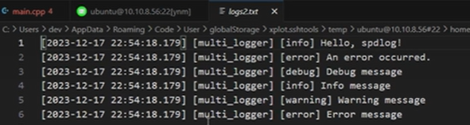

# spdlog跨平台日志库

### 一、项目介绍

项目Github地址：https://github.com/gabime/spdlog

`Spdlog` 是一个高性能的 C++ 日志库，具有简单易用的 API 和灵活的配置选项。它被设计成易于集成到现有项目中，并提供了多种日志记录器（`loggers`）、格式化选项和多线程安全的操作。

下面是一些关于 `Spdlog` 的主要特点和功能：

​		1、简单易用：Spdlog 提供简洁的 API，使得日志记录变得非常容易。你只需要包含头文件，并使用简单的方法调用即可输出日志。

​		2、多种日志目标：Spdlog 支持多种日志目标，可以将日志记录到控制台、文件、网络等不同的位置。你可以根据需求选择适合的日志目标。

​		3、灵活的格式化：Spdlog 具有灵活的日志格式化选项，可以自定义日志的输出格式。你可以按照自己的需求定义日期、时间、日志级别和其他附加信息的格式。

​		4、多线程支持：Spdlog 在设计上考虑到多线程环境下的安全性，可以在多个线程中同时记录日志，而无需担心竞争条件。

​		5、高性能：Spdlog 使用异步日志记录方式和高效的写入策略，以提供卓越的性能。它可以处理大量的日志消息而不会对应用程序的性能产生显著影响。

​		6、支持不同的日志级别：Spdlog 提供了不同的日志级别（如 DEBUG、INFO、WARNING、ERROR 等），可以根据需求选择适当的级别进行日志记录，以帮助你更好地控制日志输出。

​		7、集成第三方库：Spdlog 可以与其他流行的 C++ 库和框架集成，如 fmtlib、Google Protocol Buffers (protobuf) 等。

​		8、跨平台支持：Spdlog 支持在多个操作系统和编译器上运行，包括 Windows、Linux 和 macOS。它可以无缝地在不同平台上提供一致的 API 和功能。

### 二、环境配置

环境配置：

```
# apt安装
sudo apt install libspdlog-dev
# 编译
g++ -o main main.cpp -lspdlog && ./main


# cmake配置
cmake_minimum_required(VERSION 3.0)
project(YourProject)

find_package(spdlog REQUIRED)

add_executable(YourExecutable your_source_files.cpp)
target_link_libraries(YourExecutable PRIVATE spdlog::spdlog)
```

### 三、使用说明

​	最简示例：

```
#include <spdlog/spdlog.h>

int main() {
  // 设置日志级别为 DEBUG
  spdlog::set_level(spdlog::level::debug);

  // 输出不同级别的日志
  spdlog::debug("This is a debug message");
  spdlog::info("This is an info message");
  spdlog::warn("This is a warning message");
  spdlog::error("This is an error message");

  return 0;
}
```

​	

​	设置两个logger，分别输出在终端和日志文件中：

```
#include <iostream>
#include <spdlog/spdlog.h>
#include "spdlog/sinks/basic_file_sink.h"
#include "spdlog/sinks/stdout_color_sinks.h"

int main()
{
    // 创建一个名为 "logger" 的logger
    auto console = spdlog::stdout_color_mt("logger");

    // 创建一个名为 "logger_2" 的logger
    auto file = spdlog::basic_logger_mt("logger_2", "log1.txt");

    // 设置日志级别为 info
    console->set_level(spdlog::level::debug);
    file->set_level(spdlog::level::info);

    // 输出不同级别的日志
    console->debug("This is debug message");
    console->info("Welcome to spdlog!");
    console->error("Some error message with arg{}", 1);
    file->debug("This is debug message");
    file->info("Welcome to spdlog, from a file!");
    file->error("Some error message with arg{}", 2);

    return 0;
}
```






​	同时输出到终端和文件实例：

```#include <spdlog/spdlog.h>
#include <spdlog/sinks/stdout_color_sinks.h>
#include <spdlog/sinks/basic_file_sink.h>

int main()
{
    // 创建控制台输出日志记录器
    auto consoleSink = std::make_shared<spdlog::sinks::stdout_color_sink_mt>();
    auto consoleLogger = std::make_shared<spdlog::logger>("console", consoleSink);

    // 创建文件输出日志记录器
    auto fileSink = std::make_shared<spdlog::sinks::basic_file_sink_mt>("logs2.txt");
    auto fileLogger = std::make_shared<spdlog::logger>("file", fileSink);

    // 将控制台和文件日志记录器添加到复合日志记录器中
    spdlog::sinks_init_list sinks = { consoleSink, fileSink };
    auto multiLogger = std::make_shared<spdlog::logger>("multi_logger", sinks.begin(), sinks.end());

    // 设置默认日志记录器为复合日志记录器
    spdlog::set_default_logger(multiLogger);

	// 设置日志级别
    spdlog::set_level(spdlog::level::debug);

    // 设置日志消息的格式
    // spdlog::set_pattern("[%Y-%m-%d %H:%M:%S.%e] [%l] %v");

    // 记录日志消息
    spdlog::info("Hello, spdlog!");
    spdlog::error("An error occurred.");

    spdlog::debug("Debug message");
    spdlog::info("Info message");
    spdlog::warn("Warning message");
    spdlog::error("Error message");

    // 刷新并关闭所有日志记录器
    spdlog::drop_all();

    return 0;
}
```



