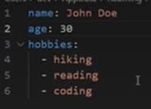
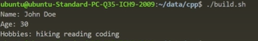

# yaml-cpp数据解析库

### 一、yaml介绍

YAML（YAML Ain’t Markup Language）是一种简单可读的数据序列化格式。它是一种简洁和易于理解的语言，用于表示数据结构和配置信息。YAML最初是为了在不同编程语言之间交换数据而设计的，但它也被广泛用于配置文件、日志文件以及其他需要结构化数据的地方。

YAML采用了一种基于缩进的语法来表示数据的层次结构。它使用空格缩进来表示层级关系，而不是像XML或JSON那样使用特殊的标记符号。这使得YAML文件在视觉上更具可读性，并且可以使用普通文本编辑器进行编辑。

YAML还支持一些高级特性，如引用、包含外部文件、多行字符串等。它的灵活性使得它成为许多应用程序中处理配置文件和数据交换的首选格式。

### 二、yaml-cpp库安装

Github仓库：https://github.com/jbeder/yaml-cpp

教程：https://github.com/jbeder/yaml-cpp/wiki/Tutorial

```
# apt安装
sudo apt install libyaml-cpp-dev
# 编译
g++ -o main main.cpp -lyaml-cpp && ./main
```

```
# 源码安装
git clone https://github.com/jbeder/yaml-cpp.git
cd yaml-cpp
mkdir build && cd build
cmake ..
make
make test
sudo make install
```

​	yaml-cpp默认构建的就是静态库，也就是unix类系统下的.a文件

### 三、yaml读取示例

​	1、写入数据到yaml文件

```
#include <iostream>
#include <fstream>
#include "yaml-cpp/yaml.h"

int main() {
    // 创建一个包含数字、字符串和数组数据的YAML节点
    YAML::Node data;
    data["name"] = "John Doe";
    data["age"] = 30;

    // 创建一个包含数组的YAML节点
    YAML::Node hobbies;
    hobbies.push_back("hiking");
    hobbies.push_back("reading");
    hobbies.push_back("coding");
    data["hobbies"] = hobbies;

    // 将数据写入文件
    std::ofstream file("data/data.yaml");
    file << data; // 将数据流式输出到文件
    file.close();

    return 0;
}
```



​	2、读取yaml文件中的内容

```#include <iostream>
#include "yaml-cpp/yaml.h"

int main() {
    // 从文件中加载YAML数据
    YAML::Node data = YAML::LoadFile("data/data.yaml");

    // 读取数据
    std::string name = data["name"].as<std::string>();
    int age = data["age"].as<int>();
    const YAML::Node& hobbies = data["hobbies"];
    std::vector<std::string> hobbiesList;
    for (size_t i = 0; i < hobbies.size(); i++) {
        hobbiesList.push_back(hobbies[i].as<std::string>());
    }

    // 显示读取的数据
    std::cout << "Name: " << name << std::endl;
    std::cout << "Age: " << age << std::endl;
    std::cout << "Hobbies: ";
    for (const auto& hobby : hobbiesList) {
        std::cout << hobby << " ";
    }
    std::cout << std::endl;

    return 0;
}
```

